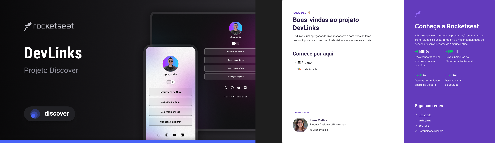

<h1 align="center">🔗 DevLinks 🔗</h1>

Criação de uma página WEB que serve como cartão de visita. Esse projeto foi desenvolvido no programa gratuito <a href="https://boracodar.dev/">Discover</a> da RocketSeat.

  <a href="#🚀-tecnologias">Tecnologias</a>&nbsp;&nbsp;&nbsp;|&nbsp;&nbsp;&nbsp;
  <a href="#💻-projeto">Projeto</a>&nbsp;&nbsp;&nbsp;|&nbsp;&nbsp;&nbsp;
  <a href="#🔖-layout">Layout</a>&nbsp;&nbsp;&nbsp;

 

  

## 🚀 Tecnologias

Esse projeto foi desenvolvido com as seguintes tecnologias:

- HTML e CSS
- JavaScript
- Git e Github
- Figma

## 💻 Projeto

O DevLinks é um agregador de links para usar como cartão de visitas online.

- [Acesse o projeto finalizado, online](https://jp-xaxa.github.io/devlinks)

- [Assistir aulas](https://lp.rocketseat.com.br/devlinks/inscricao?utm_source=github&utm_medium=descricao&utm_campaign=capture-devlinks&utm_term=organic&utm_content=descricao-github-mayk-brito)

<h1 align="center">
  Funcionalidades
</h1>

O projeto consiste em ser um cartão de visita profissional Dev, onde foi seguido o <a href="#🔖-layout">Layout</a>, da <a href="https://boracodar.dev/">RocketSeat</a>. O projeto possui:

- Pagina responsiva
- Download de arquivo PDF
- Direcionamento para contato WhastApp e E-mail
- Modo Light e Dark

## 🔖 Layout

Você pode visualizar o layout do projeto através [DESSE LINK](https://www.figma.com/community/file/1187422022288947321). É necessário ter conta no [Figma](https://figma.com) para acessá-lo.
